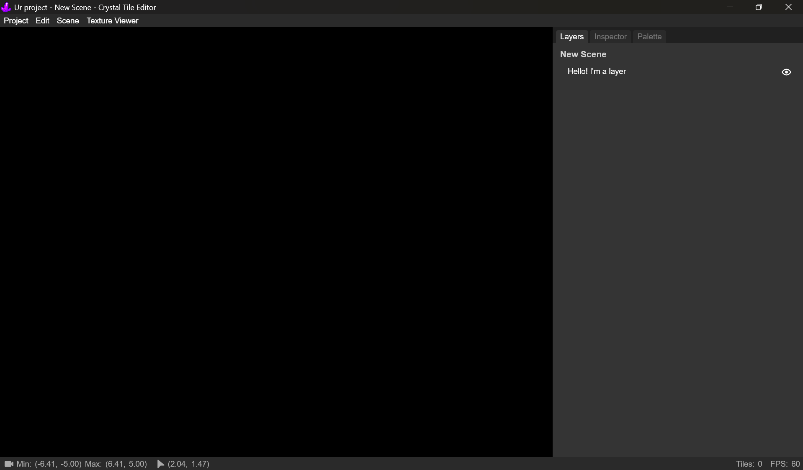

# Crystal Tile Editor

A tile editor for Crystal projects.

**Latest version**: [2025.1f (The Bare Minimum Edition)](https://github.com/CalmBubbles/tile-editor/releases/latest)<br>
**Licensed under**: [MIT](https://github.com/Crystal2D/tile-editor?tab=MIT-1-ov-file#readme)


## Requirements
- Any desktop device
- Your project


## To start using
1. Download the editor
- For windows, you can download it [here](https://github.com/Crystal2D/tile-editor/releases/latest)<br>
- For Mac and Linux, there are still no available builds.<br>
But, feel free to [make your own](https://github.com/Crystal2D/tile-editor#building-the-app-custom-build).

2. Open the app, and this window will appear
<br><br><br>
A taskbar icon will also appear
<br><br><br>

3. In the window, click `Import`
<br><br><br>
Then locate and import your project's folder
<br><br><br>

4. Once imported your project will be listed in the window, click it to open.
<br><br><br>

5. Once opened the hub window closes, and the project window opens.<br>
You'll be greeted by this
<br><br>
Where it waits for you to open an existing scene.<br><br>
If you decide to not open one, it will create a new one for you.
<br><br><br>

6. Click the `Hello! I'm a Layer`. That is in fact, a layer 
<br><br><br>

6. Explore the app lol.


## Keybinds and Shortcuts
- All Viewers (Scene Viewer, Palette Selector, Texture Mapper)
    | Function           | Bind                                 |
    |--------------------|--------------------------------------|
    | Move               | Right Click+Drag / Middle Click+Drag |
    | Zoom In            | Scroll Up / Zoom In Trackpad         |
    | Zoom Out           | Scroll Down / Zoom Out Trackpad      |
    | Use Mouse Function | Left Click                           |
    |                    |                                      |

- Scene Viewer
    | Function               | Bind  |
    |------------------------|-------|
    | Move Up                | W     |
    | Move Down              | A     |
    | Move Left              | S     |
    | Move Right             | D     |
    | Speed Up WASD Movement | Shift |
    |                        |       |

- Edit
    | Function | Bind         |
    |----------|--------------|
    | Undo     | Ctrl+Z       |
    | Redo     | Ctrl+Shift+Z |
    |          |              |

- Project
    | Function   | Bind         |
    |------------|--------------|
    | New Scene  | Ctrl+N       |
    | Open Scene | Ctrl+O       |
    | Save       | Ctrl+S       |
    | Save As    | Ctrl+Shift+S |
    |            |              |

- Drawing (Only works when a layer is focused)
    | Function                  | Bind               |
    |---------------------------|--------------------|
    | Pencil                    | B                  |
    | Eraser                    | E                  |
    | Eyedropper/Tile Picker    | P                  |
    | Rect Select Tool          | Ctrl+R             |
    | Fill Selected             | Ctrl+F             |
    | Delete Selected           | Delete / Backspace |
    | Transform Selected        | T                  |
    | Select All                | Ctrl+A             |
    | Deselect                  | Ctrl+Shift+A       |
    |                           |                    |

- Layers Tab (Only works when tab is focused)
    | Function                                     | Bind                       |
    |----------------------------------------------|----------------------------|
    | Context Menu (Only works when mouse on dock) | Right Click / Context Menu |
    | Copy                                         | Ctrl+C                     |
    | Cut                                          | Ctrl+X                     |
    | Paste                                        | Ctrl+V                     |
    | Duplicate                                    | Ctrl+D                     |
    | New Layer                                    | Ctrl+Shift+N               |
    |                                              |                            |

- Texture Mapper
    | Function        | Bind               |
    |-----------------|--------------------|
    | Save            | Ctrl+S             |
    | New Sprite      | Left Click+Drag    |
    | Delete Selected | Delete / Backspace |
    |                 |                    |


## Building the App (Custom Build)
For some reason when I'm building the app for Mac (darwin), it just gets stuck on this
<br><br><br>

And on Linux (deb), it just does this
<br><br><br>

Please help me with this so I can include more platforms in upcoming versions


### Requirements
- Node Version ^20.11
- Electron ^29.1.4
- Electron Forge ^7.4.0

## Commands
- Mac:
``` ps1
npm run make -- --platform darwin
```
- Linux:
``` ps1
npm run make -- --platform linux
```